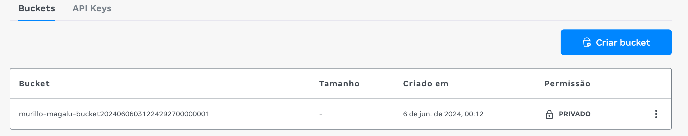

This repo contains an example about how to deploy a bucket in brazilian cloud provider [Magalu Cloud](https://magalu.cloud/)



To use this example in github actions, you need to add the following secrets in your repository:
```bash
AWS_ACCESS_KEY_ID=your_access_key_id
AWS_SECRET_ACCESS_KEY=your_secret_access_key
```